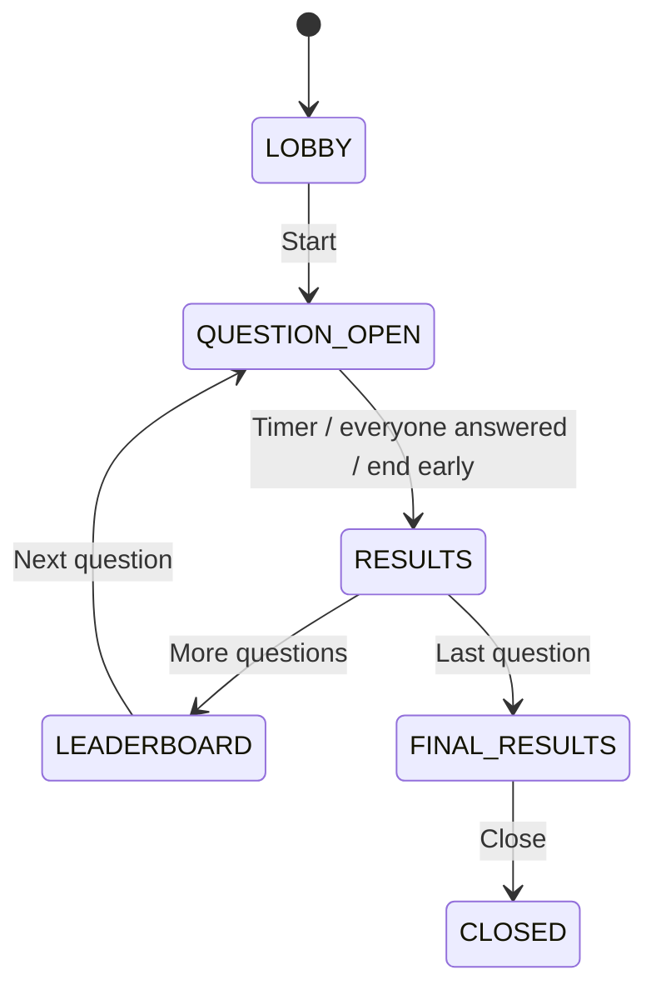

# Quizzle

**A self-hosted live quiz platform for interactive safety training.**


Quizzle turns YAML files into presenter-led quizzes. An admin starts a session, participants join by
QR code from their phones, and the presenter controls each question from a shared screen. The whole
application runs as one Spring Boot process with embedded SQLite storage and no required external
services.

## At a glance

- **Easy to host:** one Java process or Docker Compose stack.
- **Real-time:** WebSockets connect participants; Server-Sent Events update the presenter.
- **Resilient:** active sessions are snapshotted to SQLite and restored after a restart.
- **Offline-friendly:** quizzes, branding, and DiceBear avatar assets are stored locally.
- **Safe by default:** the server validates quiz files, state transitions, and answer timing.
- **Customizable:** edit YAML files to change quizzes, wording, logo, and light/dark colors.

## Quick start with Docker

Requirements: [Docker](https://docs.docker.com/get-docker/) with Docker Compose. Run the commands
from the repository root.

**PowerShell**

```powershell
$env:ADMIN_PASSWORD = 'replace-with-a-long-password'
docker compose up --build
```

**Bash**

```bash
ADMIN_PASSWORD='replace-with-a-long-password' docker compose up --build
```

Open <http://localhost:8080/admin/login>, sign in, choose a quiz, and create a session. Stop the
stack with <kbd>Ctrl</kbd>+<kbd>C</kbd>, then run `docker compose down` when you no longer need it.

> [!IMPORTANT]
> `ADMIN_PASSWORD` is required. Use a long, unique value and never commit it to the repository.

### Run directly with Java

Requirements: JDK 21. The path overrides below connect the Gradle project in `quizzle/` to the
repository-level sample quizzes, branding, and data directory.

**PowerShell**

```powershell
Set-Location .\quizzle
$env:ADMIN_PASSWORD = 'replace-with-a-long-password'
$env:QUIZ_FOLDER = '../quizzes'
$env:BRANDING_FOLDER = '../branding'
$env:QUIZ_DATABASE_PATH = '../data/quiz-snapshots.db'
.\gradlew.bat bootRun
```

**Bash**

```bash
cd quizzle
ADMIN_PASSWORD='replace-with-a-long-password' \
QUIZ_FOLDER='../quizzes' \
BRANDING_FOLDER='../branding' \
QUIZ_DATABASE_PATH='../data/quiz-snapshots.db' \
./gradlew bootRun
```

You can persist the same entries in an ignored `quizzle/.env` file. Process environment variables
take precedence over `.env`; `.env` takes precedence over built-in defaults.

## Application pages

| Page | Path | Audience |
| --- | --- | --- |
| Admin login | `/admin/login` | Quiz administrator |
| Session overview | `/admin` | Quiz administrator |
| Presenter | `/admin/sessions/{codehash}` | Shared presentation screen |
| Participant | `/{codehash}/` | Players joining by link or QR code |

`PUBLIC_BASE_URL` must be reachable from participant devices. `localhost` only works when the
browser and Quizzle run on the same machine.

## Configuration

| Variable | Default | Purpose |
| --- | --- | --- |
| `ADMIN_PASSWORD` | — | **Required.** Shared password for the admin area. |
| `SERVER_PORT` | `8080` | HTTP listening port. |
| `PUBLIC_BASE_URL` | `http://localhost:8080` | Base URL used in participant links and QR codes. |
| `SESSION_COOKIE_SECURE` | `false` | Set to `true` when the public URL uses HTTPS. |
| `QUIZ_FOLDER` | `./quizzes` | Directory scanned for `.yaml` and `.yml` quizzes. |
| `BRANDING_FOLDER` | `./branding` | Directory containing branding configuration and images. |
| `BRANDING_FILE` | `branding.yaml` | Branding filename inside `BRANDING_FOLDER`. |
| `QUIZ_DATABASE_PATH` | `./data/quiz-snapshots.db` | SQLite snapshot database. |
| `SNAPSHOT_INTERVAL_MS` | `30000` | Periodic snapshot interval. |
| `SQLITE_BUSY_TIMEOUT_MS` | `5000` | SQLite lock wait timeout. |
| `SESSION_CODEHASH_LENGTH` | `10` | Length of generated session join codes. |
| `WEBSOCKET_DISCONNECT_GRACE_MS` | `120000` | Reconnect window for disconnected participants. |
| `PLAYER_NAME_MAX_LENGTH` | `32` | Maximum participant name length. |

Heartbeat, message-size, and quiz-validation limits are also configurable. Their names and defaults
are listed in [`application.properties`](quizzle/src/main/resources/application.properties).

## Create a quiz

Add one YAML file per quiz alongside
[`quizzes/safety-basics.yaml`](quizzes/safety-basics.yaml), then restart Quizzle so the catalog
reloads it. Start with that file or use this minimal example:

```yaml
title: "Workplace Safety Basics"
description: "A short introduction to safe conduct at work."
author: "Safety Team"
questions:
  - id: "emergency-exit"
    text: "What should you do when the evacuation alarm sounds?"
    points: 1000
    timeSeconds: 20
    multiple: false
    shuffle_answers: true
    answers:
      - id: "leave"
        text: "Leave by the nearest safe emergency exit"
        correct: true
      - id: "wait"
        text: "Wait at your desk"
        correct: false
```

Quizzes must have unique question IDs, at least two answers per question, and at least one correct
answer. A single-choice question must have exactly one correct answer. Invalid files are skipped and
shown in the admin catalog with a precise validation error; they do not prevent valid quizzes from
loading.

Answers are shuffled once per session by default. Set `shuffle_answers: false` when order matters.
For multiple-choice questions, a participant must select the exact correct set to score points.

## Customize the look

Edit [`branding/branding.yaml`](branding/branding.yaml) to change the product name, logo, light/dark
palette, and six answer colors. The included configuration uses
[`branding/images/quizzle.svg`](branding/images/quizzle.svg).

```yaml
name: "Quizzle"
mark: "quizzle.svg" # text, a local image filename, or an HTTPS URL
colors:
  primary: "#040066"
  accent: "#00d4ff"
answerColors:
  - "#c52f42"
  - "#1664ad"
  - "#b28200"
  - "#26824b"
  - "#7a3fa0"
  - "#c2660a"
```

All fields are optional. Colors use `#rgb` or `#rrggbb`; `answerColors` must contain exactly six
values. Restart Quizzle after changing the file. Invalid branding is logged and safely replaced by
built-in defaults.

## How a session works



- Participants join only in `LOBBY` and answer only during `QUESTION_OPEN`.
- The server accepts one answer per participant and question, before the server-side deadline.
- Points decay with the remaining time and are rounded to the nearest 10.
- During a question, the presenter sees an answer count—not the answer distribution.
- Dropped participant connections retry with backoff during the configured grace period.
- Every state change is persisted. Active sessions return after a restart; closed sessions are
  removed.

Participant avatars use a vendored DiceBear `bottts-neutral` bundle, so no avatar service is called
at runtime. A participant UUID provides a stable avatar across screens and reconnects.

## Project structure

```text
.
├── quizzle/                  Spring Boot 4.1 application and Gradle wrapper
│   └── src/main/
│       ├── java/gd/safety/quizzle/
│       └── resources/       Static admin, presenter, and participant clients
├── quizzes/                 Quiz catalog YAML files
├── branding/                Branding YAML and image assets
├── data/                    Local SQLite data (ignored by Git)
├── docs/                    Deployment documentation
├── Dockerfile
└── docker-compose.yml
```

The backend is split into admin endpoints, quiz catalog/model, session state, persistence, branding,
and WebSocket packages. The browser clients use vanilla JavaScript—there is no separate frontend
build.

## Build and test

Run the Gradle wrapper from `quizzle/`:

**PowerShell**

```powershell
Set-Location .\quizzle
.\gradlew.bat test
.\gradlew.bat bootJar
```

**Bash**

```bash
cd quizzle
./gradlew test
./gradlew bootJar
```

The executable JAR is written to `quizzle/build/libs/quizzle-0.0.1-SNAPSHOT.jar`. Tests include unit
and Spring MVC coverage. The repository also contains `smoke-test.ps1`, a restart/persistence smoke
test for a preconfigured `quizzle-test` container listening on port `18080`.

> [!NOTE]
> Run the Gradle tests without Quizzle configuration variables such as `ADMIN_PASSWORD`,
> `QUIZ_FOLDER`, or `BRANDING_FILE` in the process environment. Some tests intentionally verify
> precedence between process variables, `.env`, and test fixtures.

## Deploy

Build a production image from the repository root:

```bash
docker build -t quizzle:local .
```

For a standalone JAR deployment, set `ADMIN_PASSWORD`, `PUBLIC_BASE_URL`, and
`SESSION_COOKIE_SECURE=true` when using HTTPS, then run the built JAR from the repository root:

```bash
java -jar quizzle/build/libs/quizzle-0.0.1-SNAPSHOT.jar
```

A reverse proxy must forward WebSocket upgrades and avoid buffering `text/event-stream` responses.
The presenter automatically falls back to polling if Server-Sent Events are blocked or buffered.

For a complete TrueNAS SCALE setup, including persistent datasets, reverse proxy configuration,
updates, backups, and troubleshooting, see
[`docs/DEPLOYMENT-TRUENAS.md`](docs/DEPLOYMENT-TRUENAS.md).

## Common problems

| Symptom | Check |
| --- | --- |
| Server exits immediately | `ADMIN_PASSWORD` is missing or blank. |
| Quiz catalog is empty | `QUIZ_FOLDER` points to the directory containing the YAML files. |
| QR code opens the wrong host | `PUBLIC_BASE_URL` is not reachable from participant devices. |
| Participants repeatedly disconnect | The reverse proxy is not forwarding WebSocket upgrades. |
| Presenter shows `Live (polling)` | The proxy is buffering or blocking Server-Sent Events. |
| Sessions disappear after restart | `QUIZ_DATABASE_PATH` is not on persistent storage. |
