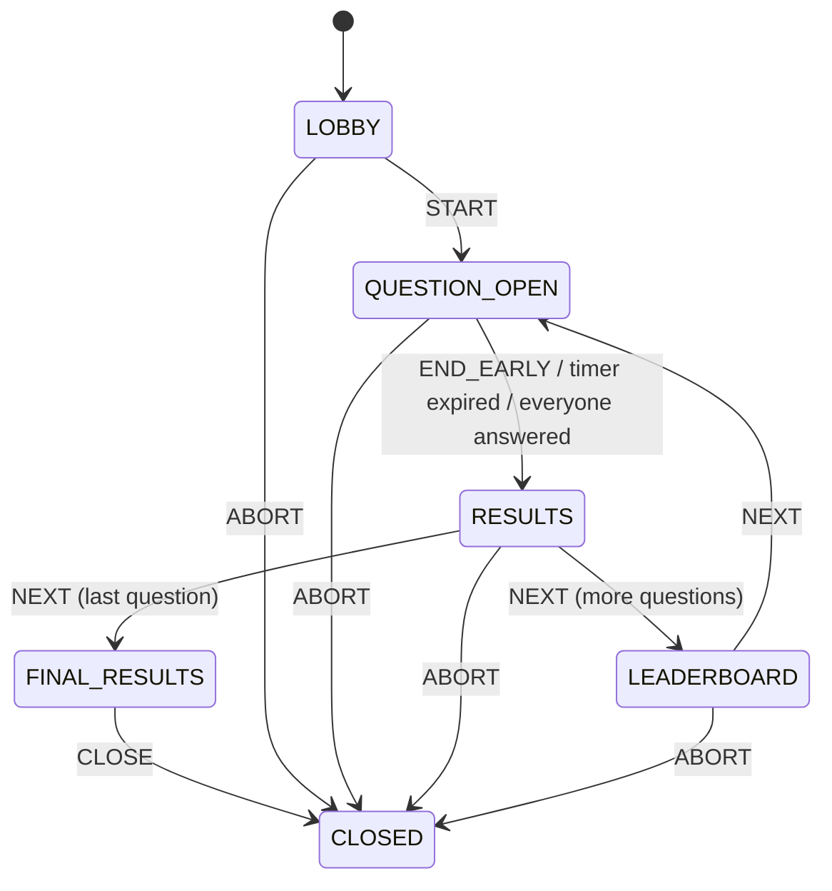

# Quizzle

A self-hosted, Kahoot-style live quiz for safety trainings. An admin picks a quiz from a folder of
YAML files, the server hands out a join code plus QR code, participants join from their phones, and
the presenter drives the quiz question by question on a beamer.

Everything runs from a single Spring Boot process with no external services: quizzes are plain YAML
files, state is persisted in an embedded SQLite database, and avatars are rendered in the browser
from a vendored copy of DiceBear. The only network the application needs is the LAN between the
server and its participants.

## Table of contents

- [Features](#features)
- [Repository layout](#repository-layout)
- [Quick start](#quick-start)
- [Configuration](#configuration)
- [Writing a quiz](#writing-a-quiz)
- [Branding](#branding)
- [How a quiz runs](#how-a-quiz-runs)
- [Scoring](#scoring)
- [Connections and reconnects](#connections-and-reconnects)
- [Persistence](#persistence)
- [Avatars](#avatars)
- [Building and testing](#building-and-testing)
- [Deployment](#deployment)

## Features

- **Admin area** protected by a single password from a local `.env` file.
- **YAML quiz catalog** loaded at startup; invalid files are skipped and listed with the exact
  validation error instead of breaking the whole catalog.
- **Join code and QR code** generated per session; participants open `https://host/<codehash>/`.
- **One persistent WebSocket per participant** for joining, questions, answers and state updates.
- **Presenter view** with lobby, floating participant avatars, live countdown, answer counter, early
  question end, per-answer bar chart and an animated winners' podium.
- **Server-authoritative state machine** – clients can never skip ahead or answer out of turn.
- **Crash-safe** – sessions survive a server restart via an SQLite snapshot.

## Repository layout

```
Backend/Quiz/                 Spring Boot application (Gradle project, root name "Quiz")
  quizzes/                    Quiz YAML files that the catalog reads at startup
  branding/                   branding.yaml with the wording and color palette
  src/main/java/gd/safety/Quiz/
    admin/                    Login, catalog and session REST endpoints, presenter page routing
    branding/                 Branding file loading and the generated CSS/JS assets
    config/                   Typed configuration properties and the .env loader
    persistence/              SQLite snapshot repository
    quiz/catalog/             YAML parsing and quiz validation
    quiz/model/               Quiz, question and answer records
    session/                  Game state machine, session registry, grading, QR codes
    websocket/                Protocol, connection hub, participant and presenter fan-out
  src/main/resources/static/  Participant, presenter and admin front-ends (vanilla JS)
docs/DEPLOYMENT-TRUENAS.md    Running Quizzle on TrueNAS SCALE
```

## Quick start

Requirements: JDK 21 (or Docker, see [Building and testing](#building-and-testing)).

```bash
cd Backend/Quiz
cp .env.example .env          # then set ADMIN_PASSWORD to a long value
./gradlew bootRun
```

Open <http://localhost:8080/admin/login>, sign in, and create a session from a quiz in the catalog.

| Page | URL | Who |
| --- | --- | --- |
| Admin login | `/admin/login` | Admin |
| Session overview | `/admin` | Admin |
| Presenter view | `/admin/sessions/{codehash}` | Admin, on the beamer |
| Participant | `/{codehash}/` | Everyone, via QR code |

The server refuses to start when `ADMIN_PASSWORD` is missing or blank.

## Configuration

Configuration comes from environment variables, or from a `.env` file next to the working directory.
Real environment variables win over `.env`, and `.env` wins over the built-in defaults. See
[`.env.example`](Backend/Quiz/.env.example).

| Variable | Default | Purpose |
| --- | --- | --- |
| `ADMIN_PASSWORD` | – | **Required.** Admin login password. |
| `SERVER_PORT` | `8080` | HTTP port. |
| `PUBLIC_BASE_URL` | `http://localhost:8080` | Base URL printed into join links and QR codes. Must be what participants can actually reach. |
| `SESSION_COOKIE_SECURE` | `false` | Set to `true` when served over HTTPS. |
| `QUIZ_FOLDER` | `./quizzes` | Folder scanned for `.yaml` / `.yml` quiz files. |
| `BRANDING_FOLDER` | `./branding` | Folder that holds the branding file. |
| `BRANDING_FILE` | `branding.yaml` | Branding file name inside that folder. |
| `QUIZ_DATABASE_PATH` | `./data/quiz-snapshots.db` | SQLite file for session snapshots. |
| `SNAPSHOT_INTERVAL_MS` | `30000` | Interval of the periodic snapshot flush. |
| `SESSION_CODEHASH_LENGTH` | `10` | Length of the generated join code. |
| `WEBSOCKET_HEARTBEAT_INTERVAL_MS` | `15000` | Server ping interval. |
| `WEBSOCKET_HEARTBEAT_TIMEOUT_MS` | `40000` | Time without a pong before the socket is closed. |
| `WEBSOCKET_DISCONNECT_GRACE_MS` | `120000` | Time a disconnected player stays reconnectable before expiring. |
| `PLAYER_NAME_MAX_LENGTH` | `32` | Maximum participant name length. |

Validation limits (`QUIZ_MAX_QUESTIONS`, `QUIZ_MAX_POINTS`, `QUIZ_MAX_TIME_SECONDS`, …) can be
overridden the same way; the defaults are listed in
[`application.properties`](Backend/Quiz/src/main/resources/application.properties).

## Writing a quiz

One YAML file describes exactly one quiz. Drop it into the quiz folder and restart the server.

```yaml
title: "Workplace Safety Basics"
description: "A short introduction to safe conduct in office and technical work areas."
author: "G+D Safety Team"

questions:
  - id: "emergency-exit"
    text: "What should you do when the evacuation alarm sounds?"
    points: 1000
    timeSeconds: 20
    multiple: false
    shuffle_answers: true   # optional, defaults to true
    answers:
      - id: "a"
        text: "Leave by the nearest safe emergency exit"
        correct: true
      - id: "b"
        text: "Finish the current task before leaving"
        correct: false
      - id: "c"
        text: "Use the elevator to leave faster"
        correct: false
```

Answers are shuffled once per session, so the correct option is not always in the same place and the
order stays identical on every screen, after a reveal, a reconnect and a server restart. Set
`shuffle_answers: false` on a question whose answers must keep their file order (for example a chronological list).

Rules enforced before a quiz enters the catalog:

- `title`, `description` and `author` are present and within the configured length limits.
- At least one question, and at most `QUIZ_MAX_QUESTIONS`.
- Question IDs are unique across the quiz; answer IDs are unique **within their question**, so `a`,
  `b`, `c` … can be reused in every question.
- IDs must not start or end with whitespace.
- Each question has at least two answers and at least one correct answer.
- With `multiple: false` there must be exactly one correct answer.
- `points` and `timeSeconds` are positive and within their configured maximums.
- `shuffle_answers` is optional and must be `true` or `false`.

A file that fails any of these checks is skipped and shown in the admin view with the reason, so a
single broken quiz never blocks the rest of the catalog. Duplicate YAML keys are rejected with the
line number.

## Branding

Wording and colors live in [`Backend/Quiz/branding/branding.yaml`](Backend/Quiz/branding/branding.yaml)
instead of the stylesheets, so a deployment can be rebranded without touching the front-end.

```yaml
name: "Safety Quiz"      # product name in the header and page titles
mark: "G+D"              # short badge next to it, at most 10 characters
colors:
  primary: "#040066"     # headings, buttons, podium
  primarySoft: "#ececff"
  accent: "#00d4ff"      # highlights, timers, winner ring
  surface: "#ffffff"     # cards
  background: "#f5f7fb"  # page background
  text: "#17162d"
  muted: "#66687a"
  border: "#e3e6ef"
  danger: "#a32035"
  dangerSoft: "#fff3f5"
  success: "#13854e"
answerColors: ["#c52f42", "#1664ad", "#b28200", "#26824b"]
```

- Every field is optional; anything left out keeps the built-in value.
- Colors must be hex (`#rgb` or `#rrggbb`), and `answerColors` must list exactly four of them.
- The file is read once at startup and served as `/assets/branding.css` and `/assets/branding.js`,
  which every page loads. Restart Quizzle after changing it.
- An unreadable or invalid file is logged and ignored – the app then starts with the defaults.

The container reads the folder from `BRANDING_FOLDER` (`/data/branding` in Docker), so mounting your
own `branding.yaml` there is enough.

## How a quiz runs

The server owns the state; every transition is validated against a state machine and rejected
otherwise.



- Participants can only join in `LOBBY`.
- Answers are only accepted in `QUESTION_OPEN`, for the currently open question, before the
  deadline, and only once per participant and question.
- A question closes as soon as every connected participant has answered it.
- While a question is open the presenter sees the number of answers received, never the
  distribution. The bar chart appears in `RESULTS`, the standings in `LEADERBOARD`.
- `FINAL_RESULTS` opens the podium right away.
- `ABORT` and `CLOSE` are behind a confirmation dialog in the presenter view.
- A session that reaches `CLOSED` is dropped from the registry and deleted from the snapshot store
  right away, so it disappears from the admin list and does not come back after a restart.

## Scoring

- A question counts as answered correctly only when the selected set matches the correct set
  **exactly** – a partially correct multiple-choice answer scores zero.
- Points decay linearly with the remaining time:
  `points × remaining / duration`, rounded to the nearest 10. Answering instantly yields the full
  value, answering at the buzzer yields close to zero.
- Ties are broken by the summed response time of all correct answers, then by the single fastest
  correct answer. Because points are time-weighted, exact ties are rare to begin with.
- The elapsed time is measured server-side from the moment the question opened, so a slow client
  clock cannot be exploited.

## Connections and reconnects

Each participant holds exactly one WebSocket for the whole quiz: `JOIN` → `JOINED` → `STATE` updates
→ `ANSWER` → `ANSWER_ACCEPTED`. The server pings every 15 s and closes sockets that stop responding.

Participants move through four states:

| State | Meaning |
| --- | --- |
| `CONNECTED` | Socket is alive. |
| `TEMPORARILY_DISCONNECTED` | Socket dropped; the reconnect token is still valid. |
| `EXPIRED` | Did not come back within `WEBSOCKET_DISCONNECT_GRACE_MS`. |
| `KICKED` | Removed by the presenter. |

On disconnect the client retries with exponential backoff and jitter (roughly 1, 2, 4, 8, 15 s, then
slower), sending the reconnect token stored in a one-day cookie scoped to the session path. A kicked
participant receives a final message, deletes its token and stops retrying.

## Persistence

Sessions are written to SQLite on every state change and additionally flushed on a timer. After a
restart the registry rehydrates all sessions: previously connected players become
`TEMPORARILY_DISCONNECTED` so their cookies still work, and a question that was open when the server
went down gets a fresh timer instead of an already-expired one. Closed sessions are deleted instead
of restored.

## Avatars

Avatars are generated in the browser with a vendored copy of
[DiceBear](https://www.dicebear.com) – `@dicebear/core` plus the `bottts-neutral` style definition
under `src/main/resources/static/assets/vendor/dicebear/`. Nothing is fetched from
`api.dicebear.com` at runtime, so the quiz works on an isolated network. The participant's UUID is
used as the seed, which makes each avatar stable across reconnects and identical on every screen.
If the style definition cannot be loaded, all views fall back to a neutral placeholder.

## Building and testing

```bash
cd Backend/Quiz
./gradlew test        # unit and MockMvc tests
./gradlew bootJar     # build/libs/Quiz-0.0.1-SNAPSHOT.jar
```

Without a local JDK, use the same image the deployment uses:

```bash
docker run --rm -v "$PWD:/app" -w /app gradle:9.5.1-jdk21 gradle test
```

> Do not set `ADMIN_PASSWORD` in the environment while running the tests – one test asserts the
> precedence order between real environment variables and `.env`.

## Deployment

See [docs/DEPLOYMENT-TRUENAS.md](docs/DEPLOYMENT-TRUENAS.md) for running Quizzle on TrueNAS SCALE
behind a reverse proxy.

For any other host, the short version is:

```bash
export ADMIN_PASSWORD='a-long-password'
export PUBLIC_BASE_URL='https://quiz.example.org'
export SESSION_COOKIE_SECURE=true
java -jar Quiz-0.0.1-SNAPSHOT.jar
```

Make sure the reverse proxy in front of Quizzle forwards WebSocket upgrades (`Upgrade` and
`Connection` headers) and does not buffer `text/event-stream`, otherwise the presenter view will not
receive live updates. Quizzle sends `X-Accel-Buffering: no` on the event stream, which nginx honours
on its own. If the stream still delivers nothing within six seconds, the presenter view falls back
to polling `/admin/api/sessions/{codehash}/state` every two seconds and shows `Live (polling)`.
