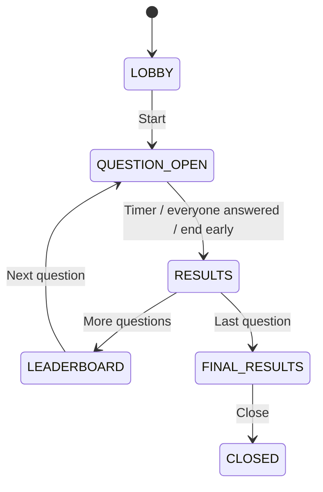

# Quizzle

**A self-hosted live quiz platform for interactive safety training.**


Quizzle turns editable quizzes into presenter-led sessions. An account holder starts a session, participants join by
QR code from their phones, and the presenter controls each question from a shared screen. The whole
application runs as one Spring Boot process backed by PostgreSQL. SMTP delivers account verification
and password-reset emails; Google sign-in is optional. The frontend remains vanilla JavaScript.

> [!WARNING]
> **Breaking storage change / clean start:** YAML accounts, per-account quiz folders and SQLite
> snapshots are not migrated or read at runtime. Back up the previous installation before upgrading.
> Re-register accounts and explicitly import quiz YAML. PostgreSQL is now the only mutable store;
> branding YAML/images remain read-only deployment files.

## At a glance

- **Easy to host:** one Java process or Docker Compose stack.
- **Real-time:** WebSockets connect participants; Server-Sent Events update the presenter.
- **Resilient:** active sessions are snapshotted to PostgreSQL and restored after a restart.
- **Offline-friendly:** quizzes, branding, and DiceBear avatar assets are stored locally.
- **Safe by default:** the server validates quiz files, state transitions, and answer timing.
- **Portable:** import/export quiz YAML; customize branding, logo, and light/dark colors with files.

## Quick start with Docker

Requirements: [Docker](https://docs.docker.com/get-docker/) with Docker Compose. Run the commands
from the repository root.

**PowerShell**

```powershell
Copy-Item .env.example .env
# Edit .env: database password, public HTTPS URL and real SMTP settings.
docker compose up -d --build
```

**Bash**

```bash
cp .env.example .env
# Edit .env: database password, public HTTPS URL and real SMTP settings.
docker compose up -d --build
```

Open your configured public URL at `/register`, register with email and password confirmation,
follow the verification email, and sign in. Create a quiz in the editor or explicitly import
[`quizzes/safety-basics.yaml`](quizzes/safety-basics.yaml), then create a session.

> [!IMPORTANT]
> A blank `ALLOWED_EMAIL_DOMAIN` allows any valid email address. Setting it restricts both local
> registration and Google sign-in to that exact domain. No local account can sign in before verification.
> SMTP must be configured. For development with captured mail, see the
> [Mailpit profile](docs/deployment.md#local-development-with-mailpit).

### Run directly with Java

Requirements: JDK 21, PostgreSQL 16 and SMTP. Copy `quizzle/.env.example` to `quizzle/.env`,
provide database credentials and start those services. PostgreSQL is required, including locally.

**PowerShell**

```powershell
Set-Location .\quizzle
.\gradlew.bat bootRun
```

**Bash**

```bash
cd quizzle
./gradlew bootRun
```

You can persist the same entries in an ignored `quizzle/.env` file; copy
[`quizzle/.env.example`](quizzle/.env.example) to get started. Process environment variables take
precedence over `.env`; `.env` takes precedence over built-in defaults.

## Application pages

| Page | Path | Audience |
| --- | --- | --- |
| Register | `/register` | New account holder |
| Login | `/login` | Returning account holder |
| Verify email | `/verify-email` | Single-use verification link |
| Forgot/reset password | `/forgot-password`, `/reset-password` | Email reset lifecycle |
| Session overview | `/admin` | Signed-in account holder — home screen; settings live in the gear panel here |
| Quiz editor | `/editor` | Signed-in account holder — presenter-style edit mode, reached by adding/editing a quiz |
| Settings | `/settings` | Signed-in account holder — legacy standalone page; the same actions live in the `/admin` gear panel |
| Presenter | `/admin/sessions/{codehash}` | Shared presentation screen |
| Participant | `/{codehash}/` | Players joining by link or QR code |

`PUBLIC_BASE_URL` must be reachable from participant devices. `localhost` only works when the
browser and Quizzle run on the same machine.

## Configuration

Configuration comes from environment variables or from a `.env` file next to the working directory.
Process environment variables win over `.env`, and `.env` wins over the built-in defaults. Copy
[`quizzle/.env.example`](quizzle/.env.example) to `quizzle/.env` as a starting point; the file is
ignored by Git.

| Variable | Default | Purpose |
| --- | --- | --- |
| `DATABASE_URL` | PostgreSQL JDBC URL | Required PostgreSQL connection; Compose supplies its internal hostname. |
| `DATABASE_USER`, `DATABASE_PASSWORD` | — | JDBC credentials; Compose derives these from `POSTGRES_USER`/`POSTGRES_PASSWORD`. |
| `POSTGRES_DB`, `POSTGRES_USER`, `POSTGRES_PASSWORD` | `quizzle`, `quizzle`, required | Compose database configuration. |
| `ALLOWED_EMAIL_DOMAIN` | blank | Optional exact-domain restriction for local and Google accounts. |
| `ACCOUNT_MIN_PASSWORD_LENGTH` | `8` | Minimum password length for registration/change. |
| `SERVER_PORT` | `8080` | HTTP listening port. |
| `PUBLIC_BASE_URL` | `http://localhost:8080` | Base URL used in participant links and QR codes. |
| `SESSION_COOKIE_SECURE` | `true` in Compose | Production HTTPS; explicitly set `false` only for local HTTP development. |
| `SMTP_HOST`, `SMTP_PORT` | required, `587` | SMTP server. |
| `SMTP_USERNAME`, `SMTP_PASSWORD`, `SMTP_AUTH`, `SMTP_STARTTLS`, `SMTP_SSL`, `SMTP_FROM` | provider-specific | SMTP credentials, transport and sender; see `.env.example`. |
| `EMAIL_VERIFICATION_TTL_MINUTES`, `PASSWORD_RESET_TTL_MINUTES` | `1440`, `30` | Bounded verification/reset token lifetimes. |
| `AUTH_RATE_LIMIT_IP_LIMIT` | `60` | Per-IP/auth-action requests per 15 minutes, validated from 1 to 1000; the per-email limit remains 10. |
| `GOOGLE_CLIENT_ID`, `GOOGLE_CLIENT_SECRET` | blank | Configure both to enable optional Google OIDC. |
| `BRANDING_FOLDER` | `./branding` | Directory containing branding configuration and images. |
| `BRANDING_FILE` | `branding.yaml` | Branding filename inside `BRANDING_FOLDER`. |
| `SNAPSHOT_INTERVAL_MS` | `30000` | Periodic snapshot interval. |
| `SESSION_CODEHASH_LENGTH` | `10` | Length of generated session join codes. |
| `AUTO_ADVANCE_DELAY_MS` | `5000` | Presenter automatic-advance delay after results or the leaderboard. |
| `ALLOW_JOIN_AFTER_START` | `false` | When `true`, new players may join after the lobby, until the session is closed. |
| `WEBSOCKET_HEARTBEAT_INTERVAL_MS` | `15000` | Server ping interval. |
| `WEBSOCKET_HEARTBEAT_TIMEOUT_MS` | `40000` | Time without a pong before the socket is closed. |
| `WEBSOCKET_DISCONNECT_GRACE_MS` | `120000` | Reconnect window for disconnected participants. |
| `PLAYER_NAME_MAX_LENGTH` | `32` | Maximum participant name length. |

Quiz-validation limits (`QUIZ_MAX_QUESTIONS`, `QUIZ_MAX_POINTS`, `QUIZ_MAX_TIME_SECONDS`, …) and the
WebSocket message-size limits can be overridden the same way. Their names and defaults are listed in
[`application.properties`](quizzle/src/main/resources/application.properties).

## Create a quiz

Use the editor's **Save** action or **Import YAML**. Only database rows owned by your account appear
in the catalog; placing files in a folder does not load them. **Export YAML** produces a portable
copy. Start with [`quizzes/safety-basics.yaml`](quizzes/safety-basics.yaml) or this example:

```yaml
title: "Workplace Safety Basics"
description: "A short introduction to safe conduct at work."
author: "Safety Team"
questions:
  - id: "emergency-exit"
    text: "What should you do when the evacuation alarm sounds?"
    points: 1000
    timeSeconds: 20
    multiple: false
    shuffle_answers: true
    answers:
      - id: "leave"
        text: "Leave by the nearest safe emergency exit"
        correct: true
      - id: "wait"
        text: "Wait at your desk"
        correct: false
```

Quizzes must have unique question IDs, at least two answers per question, and at least one correct
answer. A single-choice question must have exactly one correct answer. Invalid imports and saves are rejected without overwriting the stored quiz.
Drafts with no questions can be edited, but sessions need a playable quiz.

The editor keeps account-isolated local drafts and shows save/offline/conflict status. Restore or
discard a recovered draft explicitly. A stale revision returns a conflict rather than silently
overwriting another tab's changes. Local drafts are tied to the current browser/origin and are
not a backup.

Answers are shuffled once per session by default. Set `shuffle_answers: false` when order matters.
For multiple-choice questions, a participant must select the exact correct set to score points.

## Customize the look

Edit [`branding/branding.yaml`](branding/branding.yaml) to change the product name, logo, light/dark
palette, and six answer colors. The included configuration uses
[`branding/images/quizzle.svg`](branding/images/quizzle.svg).

```yaml
name: "Quizzle"
mark: "quizzle.svg" # text, a local image filename, or an HTTPS URL
colors:
  primary: "#040066"
  accent: "#00d4ff"
answerColors:
  - "#c52f42"
  - "#1664ad"
  - "#b28200"
  - "#26824b"
  - "#7a3fa0"
  - "#c2660a"
```

All fields are optional. Colors use `#rgb` or `#rrggbb`; `answerColors` must contain exactly six
values. Restart Quizzle after changing the file. Invalid branding is logged and safely replaced by
built-in defaults.

## How a session works


```mermaid
stateDiagram-v2
    [*] --> LOBBY
    LOBBY --> QUESTION_OPEN: Start
    QUESTION_OPEN --> RESULTS: Timer / everyone answered / end early
    RESULTS --> LEADERBOARD: More questions
    LEADERBOARD --> QUESTION_OPEN: Next question
    RESULTS --> FINAL_RESULTS: Last question
    FINAL_RESULTS --> CLOSED: Close
```

- Participants join only in `LOBBY` and answer only during `QUESTION_OPEN`.
- The server accepts one answer per participant and question, before the server-side deadline.
- Points decay with the remaining time and are rounded to the nearest 10.
- During a question, the presenter sees an answer count—not the answer distribution.
- Dropped participant connections retry with backoff during the configured grace period.
- Every state change is persisted. Active sessions return after a restart; closed sessions are
  removed.

Participant avatars use a vendored DiceBear `bottts-neutral` bundle, so no avatar service is called
at runtime. A participant UUID provides a stable avatar across screens and reconnects.

## Project structure

```text
.
├── quizzle/                  Spring Boot 4.1 application and Gradle wrapper
│   └── src/main/
│       ├── java/org/dev/quizzle/
│       └── resources/       Static admin, presenter, and participant clients
├── quizzes/                 YAML samples for explicit import
├── branding/                Branding YAML and image assets
├── e2e/                     Playwright browser suites
├── load/                    Protocol-aware k6 scenarios
├── scripts/                 Compose smoke, backup and restore
├── docs/                    Deployment documentation
├── Dockerfile
└── docker-compose.yml
```

The backend is split into admin endpoints, quiz catalog/model, session state, persistence, branding,
and WebSocket packages. The browser clients use vanilla JavaScript—there is no separate frontend
build.

## Build and test

Run the Gradle wrapper from `quizzle/`:

**PowerShell**

```powershell
Set-Location .\quizzle
.\gradlew.bat test
.\gradlew.bat bootJar
# Requires Docker: real PostgreSQL, no H2 substitute.
.\gradlew.bat integrationTest
```

**Bash**

```bash
cd quizzle
./gradlew test
./gradlew bootJar
./gradlew integrationTest # requires Docker
```

The executable JAR is written to `quizzle/build/libs/quizzle-0.0.1-SNAPSHOT.jar`. Tests include unit
and MVC coverage. PostgreSQL tests use Testcontainers and run separately with `integrationTest`.
The [deployment guide](docs/deployment.md#validation-commands) lists browser, Compose, security and
load commands. Heavy suites run nightly/manually rather than on every small change.

> [!NOTE]
> Run the Gradle tests without Quizzle configuration variables such as `ALLOWED_EMAIL_DOMAIN`
> or `BRANDING_FILE` in the process environment. Some tests intentionally verify
> precedence between process variables, `.env`, and test fixtures.

## Deploy

### Container image

Build a production image from the repository root. The multi-stage [`Dockerfile`](Dockerfile) builds
the JAR with `gradle:9.5.1-jdk21` and runs it on `eclipse-temurin:21-jre-alpine` as the unprivileged user
`quizzle` (UID 10001):

```bash
docker build -t quizzle:local .
```

The application image has no mutable account/quiz filesystem. PostgreSQL stores all account,
token, settings, quiz and snapshot rows in the `postgres-data` named volume.

| Path | Contents | Mount |
| --- | --- | --- |
| `/branding` | `branding.yaml` and `images/` | read-only application mount |
| `/var/lib/postgresql/data` | PostgreSQL 16 database | named volume on database container |

[`docker-compose.yml`](docker-compose.yml) publishes application port `8080`; PostgreSQL has no
host port. Configure the ignored root `.env` before starting:

```bash
docker compose up -d --build
```

### Standalone JAR

Optionally set `ALLOWED_EMAIL_DOMAIN`, point `PUBLIC_BASE_URL` at the address participants actually reach, and
enable `SESSION_COOKIE_SECURE` when serving over HTTPS. Run the JAR from the repository root so the
default relative paths resolve:

```bash
export PUBLIC_BASE_URL='https://quiz.example.org'
export SESSION_COOKIE_SECURE=true
export BRANDING_FOLDER=./branding
# Also configure DATABASE_URL/USER/PASSWORD and SMTP_*.
java -jar quizzle/build/libs/quizzle-0.0.1-SNAPSHOT.jar
```

### Reverse proxy

A reverse proxy in front of Quizzle must:

- forward WebSocket upgrades — pass through the `Upgrade` and `Connection` headers, otherwise
  participants cannot join or answer;
- **not** buffer `text/event-stream` responses, otherwise the presenter view receives no live
  updates. Quizzle sends `X-Accel-Buffering: no` on the event stream, which nginx honours on its own;
- allow idle connections to live longer than `WEBSOCKET_HEARTBEAT_TIMEOUT_MS` (default 40 s);
- keep `PUBLIC_BASE_URL` fixed to the external HTTPS origin; auth links never trust the Host header.

If the event stream delivers nothing within six seconds, the presenter falls back to polling
`/admin/api/sessions/{codehash}/state` every two seconds and shows `Live (polling)`.

### Data and updates

Sessions are written to PostgreSQL on state changes and flushed again on a timer. After a restart
the registry rehydrates open sessions: previously connected players become
`TEMPORARILY_DISCONNECTED` so their cookies keep working, and a question that was open when the
server stopped gets a fresh timer instead of an already-expired one. Closed sessions are deleted
instead of restored. Back up PostgreSQL with `bash scripts/backup.sh`; keep branding separately.
`docker compose down` preserves the named volume; **`docker compose down -v` deletes it**.
Flyway automatically upgrades the schema at startup. Application rollback across schema changes
may require restoring the pre-upgrade database; consult [backup/upgrade guidance](docs/deployment.md).
Branding files are read once at startup.

For a complete TrueNAS SCALE setup, including persistent datasets, reverse proxy configuration,
updates, backups, and troubleshooting, see
[`docs/DEPLOYMENT-TRUENAS.md`](docs/DEPLOYMENT-TRUENAS.md).

## Common problems

| Symptom | Check |
| --- | --- |
| Server exits immediately | PostgreSQL readiness/credentials and required SMTP configuration. |
| Verification/reset email does not arrive | SMTP host, sender, TLS/auth settings and provider delivery logs. |
| Quiz catalog is empty | Create a quiz or explicitly import YAML while signed in. |
| QR code opens the wrong host | `PUBLIC_BASE_URL` is not reachable from participant devices. |
| Participants repeatedly disconnect | The reverse proxy is not forwarding WebSocket upgrades. |
| Presenter shows `Live (polling)` | The proxy is buffering or blocking Server-Sent Events. |
| Data disappears after restart | Database volume/mount or accidental `down -v`; never remove production volumes. |

- Participants join in `LOBBY`. Set `ALLOW_JOIN_AFTER_START=true` to also accept joins after the quiz starts, until the session is closed. Answers are accepted only during `QUESTION_OPEN`.
